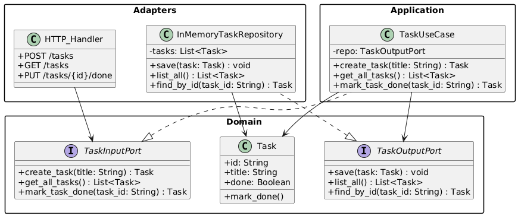

# Task Manager – Hexagonal Architecture

This service allows you to create and list tasks using a hexagonal architecture (ports and adapters). Business logic is decoupled from infrastructure details, such as the web framework or storage.

---

## 🧠 Explicación del sistema

El sistema está organizado en capas siguiendo la arquitectura hexagonal:

- **Domain:** Contiene la clase `Task` con su estado y comportamiento.
- **Ports:** Interfaces abstractas para entrada (use cases) y salida (repositorios).
- **Use Cases:** Implementan la lógica de negocio usando los puertos definidos.
- **Adapters:** Incluyen la API HTTP y un repositorio en memoria.
- **Main:** Ensambla todas las piezas y arranca la aplicación.

---

## 📐 Class/Module Diagram



---

## 📋 Endpoints

### ➕ Create a task

Create a new task with a title.

**Request:**
```json
{
  "title": "Finish challenge"
}
```

**Response:**
```json
{
  "id": "uuid-string",
  "title": "Finish challenge",
  "done": false
}
```

**Curl**
```bash
curl -X POST http://localhost:5000/tasks \
  -H "Content-Type: application/json" \
  -d '{"title": "Aprender arquitectura hexagonal"}'
```

### 📄 List all tasks

Returns a list of all created tasks.

**Response:**
```json
[
  {
    "id": "uuid-string",
    "title": "Finish challenge",
    "done": false
  }
]
```

**Curl**
```bash
curl http://localhost:5000/tasks
```

### ✔️ Mark a task as completed

Changes the task status 'done' to true
First, get the task ID by listing the tasks. Then replace <ID> with that value:

**Response:**
```json
{
  "id": "uuid-string",
  "title": "Finish challenge",
  "done": true
}
```

**Curl**
```bash
curl -X PUT http://localhost:5000/tasks/<ID>/done
```

---

### 🔳 Testing (con curl en CMD)

**Crear tarea**
```bash
curl -X POST http://localhost:5000/tasks -H "Content-Type: application/json" -d "{\"title\": \"Finish challenge\"}"
```

**Listar tareas**
```bash
curl http://localhost:5000/tasks
```

**Marcar como completada (reemplaza <ID>)**
```bash
curl -X PUT http://localhost:5000/tasks/<ID>/done
```

---

## 🛠️ Instalación y Ejecución

1. Clona el repositorio:

```bash
git clone https://github.com/SwEng2-2025i/MV7h.git
cd Class_Activity_1
cd Cuervos
```

2. Instala Flask:
   
```bash
pip install flask
```

3. Ejecuta la app:
   
```bash
python main.py
```
El servidor estará disponible en http://localhost:5000.
